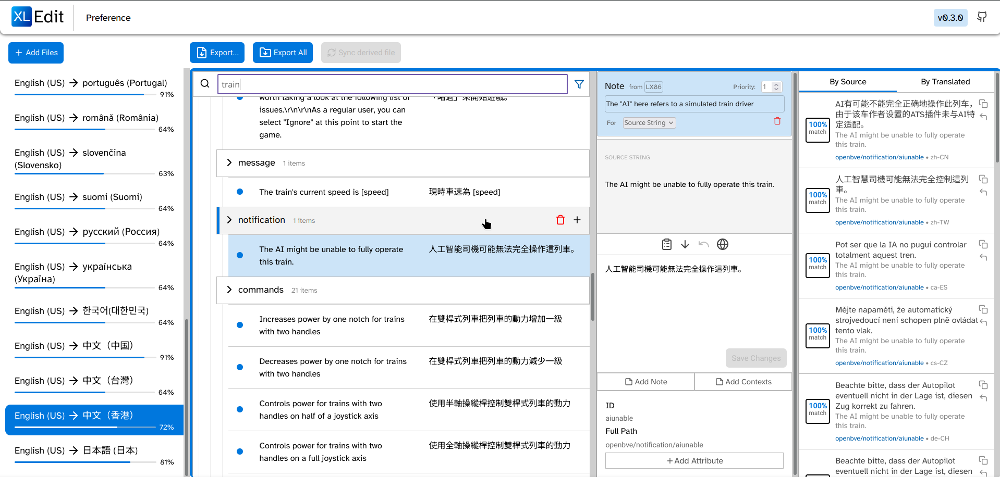

# XLEdit
XLEdit is a web-based translation editor, supporting the [XLIFF](https://en.wikipedia.org/wiki/XLIFF) localization format & Minecraft Language files.

## Features
- Import/export multiple XLIFF language files and cross-reference them in suggestions
- Apply edit to all languages by editing the original source file
- Add/Remove/Edit Translation Groups, Translation Entry, Notes and Contexts

## What isn't supported (yet, hopefully)
- Importing XLIFF 2.x files
- Attributes for &lt;source&gt; and &lt;target&gt;
- &lt;bin-*&gt;
- [Inline Elements](https://docs.oasis-open.org/xliff/v1.2/os/xliff-core.html#Struct_InLine)
- &lt;phase&gt; and &lt;phase-group&gt;
- Many more

## Roadmap
- Basic Translation Memory
- Re-export multiple xliff file tag with the same file
- Add translation for the UI
- (UI) Dark Mode
- More XLIFF 1 implementation
- XLIFF 2 support

## Development Model
Mood-driven~

## FAQ
### I tried importing my XLIFF file and some parts doesn't behave as I expected
The XLIFF format is quite versatile, as such there are likely lots of cases where things would go wrong and that I have not accounted for.
In any case, [Please raise an issue here](https://github.com/Kenny-Hui/xledit/issues), along with a sample xliff file that can reproduce the issue, and when I feel good one day I may have a look at it :)

### What happens if I mix different set of translation files together?
While not the intended use case, you should be able to edit **non-source** files with different content.
It is however not recommended to edit the source file while different translation files are loaded, as it is assumed that the source file is the basis for other files loaded.

## Credits
- [Lucide](https://github.com/lucide-icons/lucide) - Provids icons for the XLEdit user interface
- [JSZip](https://github.com/Stuk/jszip), [xml-beautify](https://github.com/riversun/xml-beautify), [string-similarity-js](https://www.npmjs.com/package/string-similarity-js) - Maintaining libraries that XLEdit and possibly dozens of website you visit everyday uses.
- Modern Web Browsers - Achieves reasonable performance & resource usage all without me worrying about optimizations (yet).

## License
This project is licensed under the MIT License.